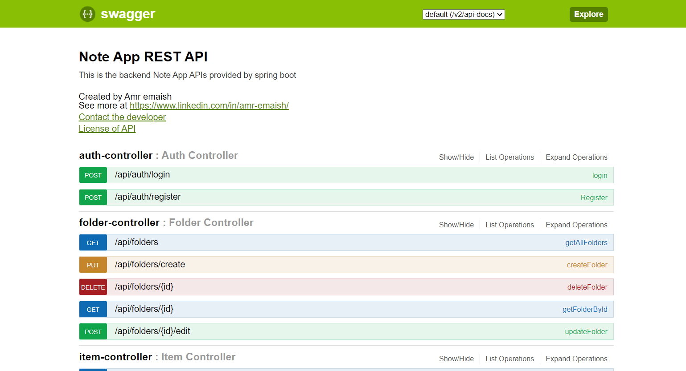
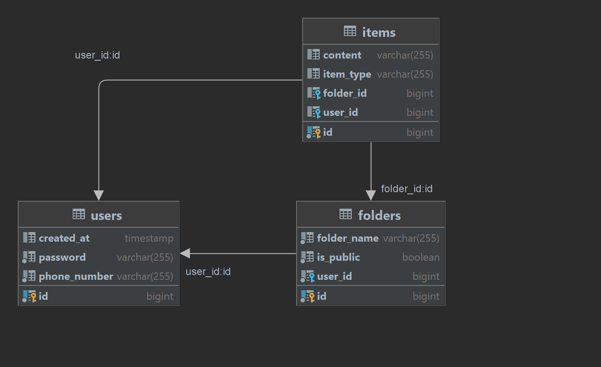

# Notes App Backend

## Summary

This project demonstrates the development of a backend system using Spring Boot for a notes app supporting multiple users. The application's core features include user authentication, folder creation (both public and private), adding text notes and image uploads to folders, and ensuring users can access their private and public folders. Additionally, it implements JWT-based authentication and utilizes Postgres as the database.

## Tech Stack

- **Framework**: Spring Boot 2.4
- **Authentication**: JWT-based authentication & stateless session
- **Database**: Postgres 12
- **Languages**: Java 8
- **Build Tool**: Maven
- **Tomcat Server**
- **Swagger — UI for API documentation**

How to Run the Project
-----------------

1. **Clone the Repository:**
    ```bash
    git clone https://github.com/amremaish/NoteApp.git
    cd NoteApp
    ```

2. **Set Up the Database:**
    - Install Postgres if you haven't already.
    - Create a new database named `notes`.
    - Update the `application.properties` file with your database credentials.

3. **Build and Run the Application:**
    - Open the project in your preferred Java IDE (e.g., IntelliJ IDEA, Eclipse).
    - Build and run the application.
    - Alternatively, you can use Maven to build and run the application:

      ```bash
      mvn spring-boot:run
      ```

4. **Test the Endpoints:**
    - Once the application is running, you can test the endpoints using tools like Postman or curl.

API Documentation
-----------------

Postman Collection => [API Documentation](https://documenter.getpostman.com/view/10370774/2sA2r9Uha7) 

Swagger => http://localhost:8080/swagger-ui.html



Database Schema
-----------------


Details
-----------------

### User Authentication

- Implement a robust user authentication system, allowing users to log in using their mobile numbers and passwords.
- Integrate JWT-based authentication for secure access to the app.

### Folder Management

- Develop functionality that enables users to create both public and private folders.

### Note and Image Management

- Within each folder, build the capability for users to add text notes and upload images.

### Access Control

- Ensure that users can view the content of their private folders and public folders.

### Database Integration

- Utilize Postgres as the database to store user data, folders, notes, and images.


Controllers and Endpoints
-----------------

### AuthController

- **POST /api/auth/login**
  - Endpoint for user authentication
  - Parameters:
    - `phoneNumber` (String): User's phone number
    - `password` (String): User's password
  - Returns:
    - JWT token upon successful authentication

- **POST /api/auth/register**
  - Endpoint for user registration
  - Parameters:
    - `User` object: User details including phone number and password
  - Returns:
    - Newly registered user details

### FolderController

- **GET /api/folders**
  - Retrieve all folders
  - Parameters:
    - `page` (int, default 0): Page number
    - `size` (int, default 10): Number of items per page

- **GET /api/folders/{id}**
  - Retrieve a folder by ID
  - Parameters:
    - `id` (Long): Folder ID

- **PUT /api/folders/create**
  - Create a new folder
  - Parameters:
    - `FolderModel` object: Folder details

- **POST /api/folders/{id}/edit**
  - Update an existing folder
  - Parameters:
    - `id` (Long): Folder ID
    - `FolderModel` object: Updated folder details

- **DELETE /api/folders/{id}**
  - Delete a folder by ID
  - Parameters:
    - `id` (Long): Folder ID

### ItemController

- **GET /api/items/{folder_id}**
  - Retrieve all items in a folder
  - Parameters:
    - `folder_id` (Long): Folder ID
    - `page` (int, default 0): Page number
    - `size` (int, default 10): Number of items per page

- **GET /api/items/byId/{id}**
  - Retrieve an item by ID
  - Parameters:
    - `id` (Long): Item ID

- **GET /api/items/{item_id}/content**
  - Retrieve content of an item
  - Parameters:
    - `item_id` (Long): Item ID

- **PUT /api/items/{folder_id}/create**
  - Create a new item in a folder
  - Parameters:
    - `folder_id` (Long): Folder ID
    - `ItemModel` object: Item details
    - `image` (MultipartFile, optional): Image file

- **POST /api/items/{item_id}/update**
  - Update an existing item
  - Parameters:
    - `item_id` (Long): Item ID
    - `ItemModel` object: Updated item details
    - `image` (MultipartFile, optional): Updated image file

- **DELETE /api/items/{id}**
  - Delete an item by ID
  - Parameters:
    - `id` (Long): Item ID

## Entities

### User

- Represents a user in the system
- Fields:
  - `id` (Long): User ID
  - `phoneNumber` (String): User's phone number
  - `password` (String): User's password
  - `created_at` (Date): Date and time when the user was created

### Folder

- Represents a folder in the user's notes
- Fields:
  - `id` (Long): Folder ID
  - `user` (User): User who owns the folder
  - `folderName` (String): Name of the folder
  - `isPublic` (boolean): Indicates if the folder is public

### Item

- Represents an item within a folder
- Fields:
  - `id` (Long): Item ID
  - `folder` (Folder): Folder containing the item
  - `user` (User): User who owns the item
  - `itemType` (ItemType): Type of the item
  - `content` (String): Content of the item
